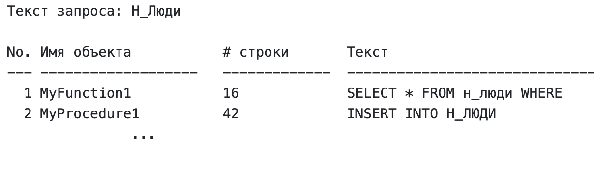

# dbms-lab-1
`Вариант 368995`

Используя сведения из системных каталогов, сформировать запрос, реализующий полнотекстовый поиск по исходному коду всех процедур, функций и триггеров в пределах заданной схемы. Поиск должен осуществляться независимо от регистра символов в строке запроса. Полученная информация должна быть представлена в виде списка следующего вида:

